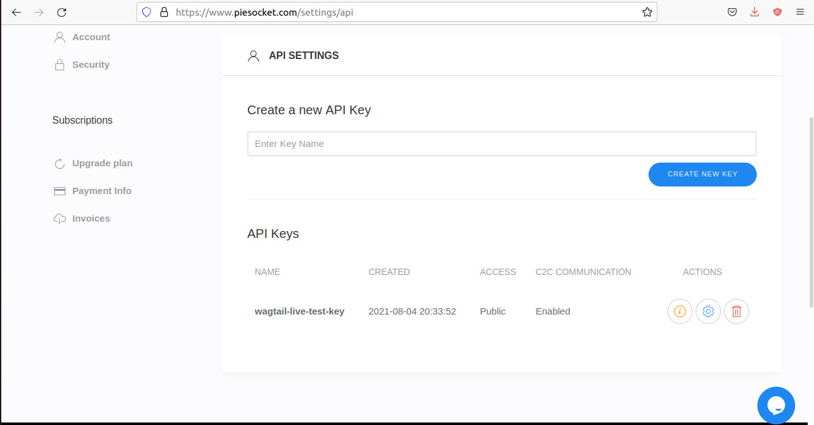
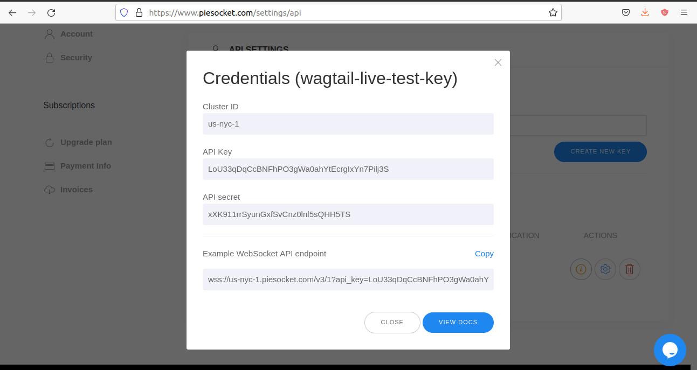

# Set up PieSocket publisher

---

**Note:** PieSocket proposes a free-plus plan to Wagtail-live users which consists of the free plan with a daily rate message increased to 1 million. To benefit from it, follow the partner link instead of the regular one.

---

This document describes how to set up a publisher using [PieSocket](https://www.piesocket.com/)([partner link](https://www.piesocket.com/?partner=2106)) websocket server API.

## Create a PieSocket account

First, you will need to create a PieSocket account [here](https://www.piesocket.com/pricing)([partner link](https://www.piesocket.com/pricing/?partner=2106)).

## Create a new API key

Once you have created an account, you will need to create a new **API KEY**.
In your dashboard, fill in the key name field and click the `CREATE NEW KEY` button.




## Retrieve your API key, your secret and PieSocket endpoint

Wagtail Live needs your `API_KEY` and your `SECRET`. It also needs the API endpoint to use.
After creating a new key, you can click the little information icon to find them as shown below:



### Save your credentials

Let's save the API key and the secret as environment variables like this:

**On Windows** (cmd.exe):

```doscon
> SET PIESOCKET_API_KEY=<your-api-key>
> SET PIESOCKET_SECRET=<your-secret>>
```

**On GNU/Linux or MacOS** (bash):

```console
$ export PIESOCKET_API_KEY=<your-api-key>
$ export PIESOCKET_SECRET=<your-secret>>
```

### Add your credentials and PieSocket endpoint to `settings`

The PieSocket endpoint depends on the cluster. In the above image the PieSocket endpoint is: `us-nyc-1.piesocket.com/v3/`.

Add the following in your `settings.base` file:
```python
PIESOCKET_API_KEY = os.environ['PIESOCKET_API_KEY']
PIESOCKET_SECRET = os.environ['PIESOCKET_SECRET']
PIESOCKET_ENDPOINT = "your-piesocket-endpoint"
```

## Configure `WAGTAIL_LIVE_PUBLISHER`

In order to use PieSocket for the publishing part, add this to your `settings`:
```python
WAGTAIL_LIVE_PUBLISHER = "wagtail_live.publishers.piesocket.PieSocketPublisher"
```

## Add publisher template

We also need to add this to our `live_blog_page.html` template:
```python

```
