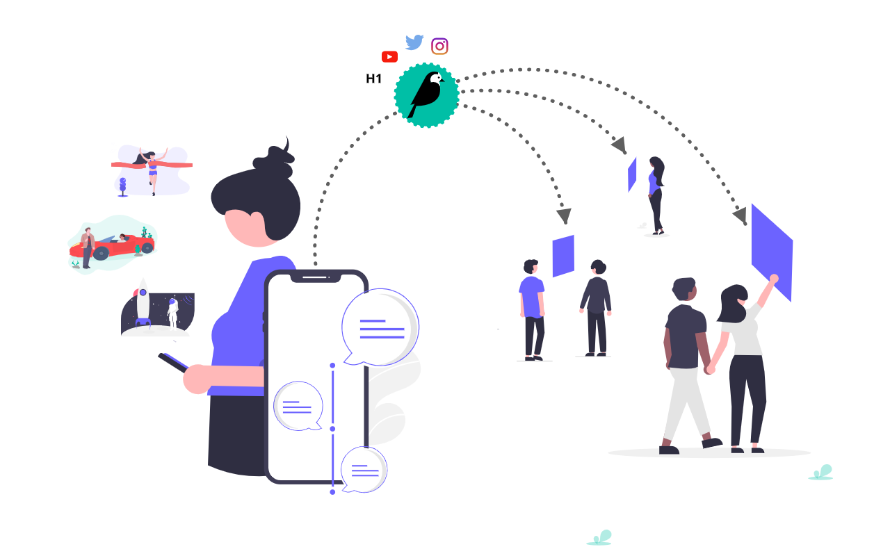

# Google Summer of Code 2021 report

The goal of the Wagtail Live project was to propose a flexible open-source liveblogging tool.

A live blog is a blog providing real-time updates on an ongoing event.

As part of the GSOC program, my mentors and I have spent summer (June-August) 2021 working on it.

This report aims to give an overview of the work done during that period.

## Design

As a blogging tool, Wagtail Live cares about how a blogger manages content.

In addition to the Wagtail admin that provides a smooth but less mobile-friendly editing interface, Wagtail Live gives a blogger the ability to use a messaging app like Slack, Telegram, Whatsapp to write blog posts.

Wagtail Live can be divided into three major components:

1. **Receivers**

    A receiver is a bridge between a messaging app and a Wagtail Live page. 

    It receives updates from the messaging app, decodes them, and saves them on the corresponding live page.

2. **LivePageMixin**

    `LivePageMixin` is the base model for live pages. 

3. **Publishers**

    A publisher is a bridge between a Wagtail Live page and web clients. 

    It delivers new/edited/deleted posts of a page to web clients viewing the page live.

## Implementation

### Milestone 1: Build a basic but working version of Wagtail Live

- [Added block types](https://github.com/wagtail/wagtail-live/pull/2)
- [Added `LivePageMixin` class](https://github.com/wagtail/wagtail-live/pull/4).

- [Implemented a base receiver class and a Slack receiver](https://github.com/wagtail/wagtail-live/pull/11)
- [Implemented `WebhookReceiverMixin`](https://github.com/wagtail/wagtail-live/pull/47).

- [Added publishers using the polling technique](https://github.com/wagtail/wagtail-live/pull/51).

At that point, Wagtail Live could be used with Slack and interval/long polling publishers.

### Milestone 2: More publishers and receivers

This milestone involved adding more publishers and receivers.

- [Added Telegram webhook receiver](https://github.com/wagtail/wagtail-live/pull/85).

- [Added a publisher based on channels](https://github.com/wagtail/wagtail-live/pull/88)
- [Added publishers based on websockets and starlette](https://github.com/wagtail/wagtail-live/pull/90)
- [Added a PieSocket publisher](https://github.com/wagtail/wagtail-live/pull/97).

### Webapp

Initially, we wanted to provide a debugging tool, `Wagtail Live debug`, to avoid setting up a messaging app in the development phase. However, we finally settled on proposing a complete alternative to messaging apps.

The `webapp` is based on Django Rest Framework and will propose a user interface. A blogger can use both the `webapp` interface and the `webapp` API to manage content.

Related PRs:

- [Wagtail Live debug](https://github.com/wagtail/wagtail-live/pull/13)
- [Renamed wagtail_live_debug to wagtail_live_interface](https://github.com/wagtail/wagtail-live/pull/19)
- [Wagtail Live Interface Receiver](https://github.com/wagtail/wagtail-live/pull/43)
- [Renamed wagtail_live_interface to webapp](https://github.com/wagtail/wagtail-live/pull/53)
- [Add image support to webapp](https://github.com/wagtail/wagtail-live/pull/67)

It's still a work in progress.

Related Issues:

- [API receiver - webapp authentication](https://github.com/wagtail/wagtail-live/issues/105)
- [webapp documentation](https://github.com/wagtail/wagtail-live/issues/107)

## Current state of the project

We've met most of the expectations outlined in the initial proposal. However, there is still some work to do. I have opened [issues](https://github.com/wagtail/wagtail-live/issues) decribing what's left.

We would like to have more users try Wagtail Live and give us feedback.

It would also be nice to have new contributors add more receivers/publishers.

## Tests and documentation

We added documentation and tests for most of the functionalities proposed.

The documentation is available at [https://wagtail.github.io/wagtail-live/](https://wagtail.github.io/wagtail-live/).

From [this PR](https://github.com/wagtail/wagtail-live/pull/104), the project is 100% covered. 

Tests can be found in the `tests` module [here](https://github.com/wagtail/wagtail-live/tree/main/tests).

## Talks

I was asked to present the project at the What's New in Wagtail webinar. The recording can be found [here](https://www.youtube.com/watch?v=CQ7Gx8b7ac4).

I'm also delivering a talk at the [Djangocon US conference](https://2021.djangocon.us/), which will take place on October 21-23, 2021.

## Feelings

From technical skills to soft skills, I've learned a lot in this project. To name a few:

- Django and Wagtail internals
- asynchronous programming
- websocket protocol
- pytest
- package releasing
- Github actions

I thank my excellent mentors who have also contributed a lot to the project besides their guidance:

- Coen van Der Kamp [@allcaps](https://github.com/allcaps)
- Tom Dyson [@tomdyson](https://github.com/tomdyson)
- Lucas Moeskops [@lucasmoeskops](https://github.com/lucasmoeskops)
- Storm Heg [@stormheg](https://github.com/Stormheg)

We have also received nice help from Nick Lee (Senior designer at Torchbox) and Andy Babic [@ababic](https://github.com/ababic).

## Links

- [Github page](https://github.com/wagtail/wagtail-live)
- [PyPI](https://pypi.org/project/wagtail-live/)
- [Wagtail Live proposal](https://docs.google.com/document/d/e/2PACX-1vRu022h-LZn-X88Ao19_p8EEf8Bj9Lr-CPXiexpTkI7EyeMmSVVufYFxsf2bHh38kG9bAIkvRDRgttW/pub)
- [GSOC project page](https://summerofcode.withgoogle.com/projects/#6430724455923712)
